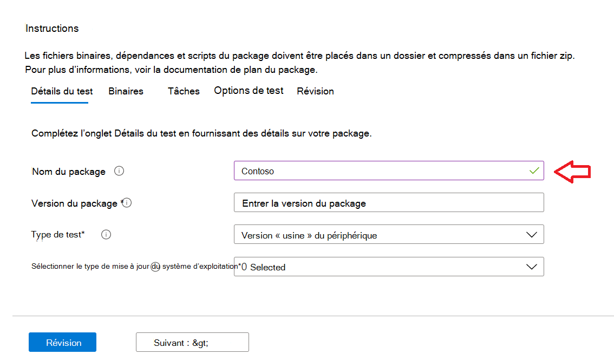
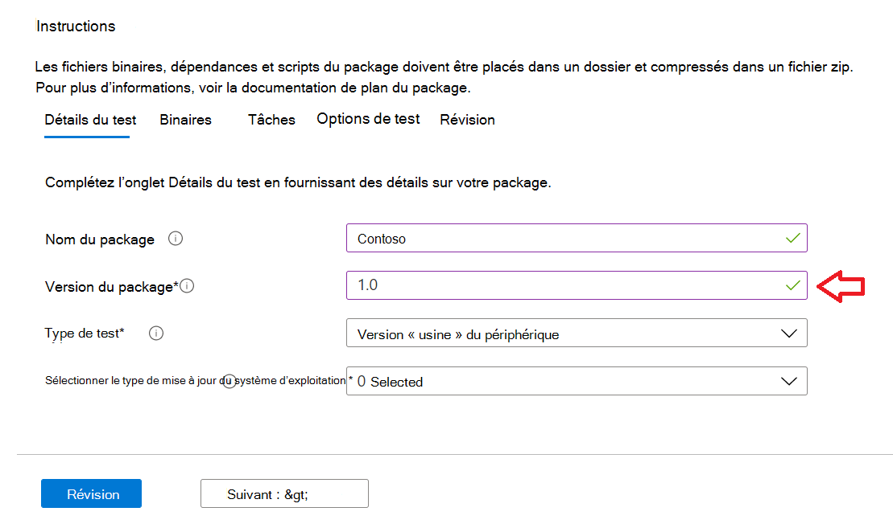

# <a name="step-2-uploading-a-package"></a>Étape 2 : Téléchargement d’un package

Dans la page Portail de base de test, accédez à l’option « Télécharger nouveau package » dans la barre de navigation de gauche, comme indiqué ci-dessous : Télécharger 

Une fois là, suivez les étapes ci-dessous pour télécharger un nouveau package.

## <a name="enter-details-for-your-package"></a>Entrer les détails de votre package

Sous l’onglet Détails du test, tapez le nom, la version et d’autres détails de votre package, comme demandé. 

Vous pouvez faire  des tests fonctionnels et **out-of-box** via ce tableau de bord.

Les étapes ci-dessous fournissent un guide sur la façon de remplir les détails de votre package :

1.  **Entrez le nom à donner à votre package dans le ```“Package name``` champ.**

> [!Note]  
> Le nom du package et la combinaison de version entrés doivent être uniques au sein de votre organisation. Cette vérification est validée par la coche, comme illustré ci-dessous.
  
  - Si vous choisissez de ré-utiliser le nom d’un package, le numéro de version doit être unique (c’est-à-dire qu’il n’a jamais été utilisé avec un package portant ce nom particulier).
  - Si la combinaison du nom du package + de la version ne passe pas la vérification de l’unicité, vous verrez un message d’erreur qui indique : « Le package avec cette version de *package* existe déjà ». 



2. **Entrez une version dans le champ « Version du package ».**



3.  **Sélectionnez le type de test que vous souhaitez exécuter sur ce package**

    Un **test OOB (Out-of-Box)** effectue une *installation,* un *lancement,* *une* fermeture et *une désinstallation* de votre package. Après l’installation, la routine de fermeture de lancement est répétée 30 fois avant l’opération de désinstallation unique. 
    
    Ce test OOB vous fournit une télémétrie normalisée sur votre package à comparer entre Windows builds.

    Un **test fonctionnel** exécuterait vos scripts de test téléchargés sur votre package. Les scripts sont exécutés dans la séquence de chargement et un échec dans un script particulier arrête l’exécution des scripts suivants.

> [!Note]
> **Tous** les scripts s’exécutent pendant 80 minutes au maximum. 
    
4.  **Sélectionner le type de mise à jour du système d’exploitation**

   - Les « mises à jour de sécurité » permettent de tester votre package contre les évolutions incrémentielles de Windows mises à jour de sécurité mensuelles pré-publiées. 
   - Les « mises à jour des fonctionnalités » permettent de tester votre package par rapport aux mises à jour de fonctionnalités Windows pré-publication bi-annuelles à partir du programme Windows Insider.
<!---
Change to the correct picture
-->


5.  **Sélectionnez les versions du système d’exploitation pour les tests de mise à jour de sécurité.**

Dans la sélection multiple, sélectionnez la ou les versions du système d’exploitation Windows votre package sera installé. 

  - Pour tester votre package par rapport Windows OSes client uniquement, sélectionnez les versions Windows système d’exploitation 11 dans la liste de menus.
  - Pour tester votre package par rapport Windows OSes serveur uniquement, sélectionnez les versions Windows système d’exploitation serveur applicables dans la liste de menus.
  - Pour tester votre package par rapport Windows OSe client et serveur, sélectionnez toutes les OS applicables dans la liste de menus. 

> [!Note]
> Si vous choisissez de tester votre package par rapport aux OS serveur et client, assurez-vous que le package est compatible et qu’il peut s’exécuter sur les deux OSes


<!---
Change to the correct picture
-->
6.  **Sélectionnez les options pour les tests de mise à jour des fonctionnalités :**

  - Dans l’option « Sélectionner le canal Insider », sélectionnez la build sur laquelle vos packages doivent ```Windows Insider Program Channel``` être testés.
  
    Nous utilisons actuellement les builds dont la version d’essai est disponible dans le canal Insider Beta.

  - Dans l’option « Sélectionner la ligne de base du système d’exploitation pour Insight », sélectionnez la version Windows système d’exploitation à utiliser comme base pour comparer les résultats de vos tests. 

> [!Note]
> Pour le moment, nous ne supportons PAS les tests de mise à jour des fonctionnalités pour les OS de serveur.
<!---
Note to actual note format for markdown
-->
<!---
Change to the correct picture
-->


7.  Une page de détails test terminée doit ressembler à ceci : 


## <a name="next-steps"></a>Étapes suivantes

Notre article suivant traite du chargement de vos fichiers binaires vers notre serivce.
> [!div class="nextstepaction"]
> [Étape suivante](binaries.md)

<!---
Add button for next page
-->

