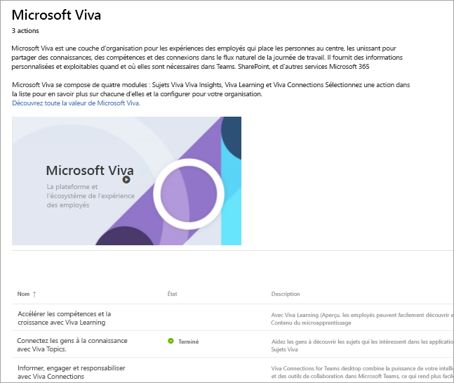

# Configuration de Microsoft Viva
Microsoft Viva est une couche d'organisation pour les expériences des employés qui met les gens au centre, les unissant pour partager des connaissances, des compétences et des connexions dans le flux naturel de la journée de travail. Il fournit des informations personnalisées et exploitables quand et où elles sont nécessaires dans Teams, SharePoint et d'autres services Microsoft 365. 

Microsoft Viva se compose de quatre modules : Viva Topics, Viva Insights, Viva Learning et Viva Connections. Pour configurer l'ensemble de la suite, vous configurerez chaque module individuellement.
 
### Commencer la configuration

Pour commencer et commencer la configuration, vous devez être un administrateur Microsoft et être connecté à votre compte. 

[Accédez directement à la page d'administration de Microsoft Viva](https://admin.microsoft.com/Adminportal/Home?source=applauncher#/featureexplorer/collections/VivaExperiences)

En bas de la page, sélectionnez le module que vous souhaitez configurer.
Sur la page du module, sélectionnez le bouton **Aller au guide de configuration**, ou dans le cas de Viva Topics, sélectionnez le bouton **Démarrer** pour accéder à l'assistant de configuration qui vous guide tout au long du processus.

Ou, si vous souhaitez configurer plus tard, vous pouvez suivre ces étapes :
1.  Accédez au centre d'administration Microsoft 365
2.  Sélectionnez **Configuration** dans la navigation de gauche
3.  Sélectionnez la vignette **Microsoft Viva**
4.  En bas de la page, sélectionnez le module que vous souhaitez configurer.
5.  Sélectionnez le bouton **Aller au guide de configuration** ou, dans le cas de Viva Topics, sélectionnez le bouton **Démarrer** pour accéder à l'assistant de configuration qui vous guide tout au long du processus.

### Informations supplémentaires
Si vous souhaitez en savoir plus sur chaque module et sur la façon dont vous allez les configurer en premier, voici quelques ressources :

**Viva Learning** 

Accélérez les compétences et la croissance – Vos employés peuvent facilement tout découvrir et tout partager, des cours de formation au contenu de micro-apprentissage.

[Vue d’ensemble](/microsoft-365/learning)

[Apprenez à le configurer](/microsoft-365/learning/set-up-teams-admin-center)

**Viva Insights**

Équilibrez productivité et bien-être – Fournit des informations basées sur les données et protégées par la confidentialité et des recommandations exploitables qui aident tous les membres de l'organisation à travailler plus intelligemment et à atteindre un équilibre.

[Vue d’ensemble](/viva/insights/introduction)

[Apprenez à le configurer](/viva/insights/setup/setup-intro)

**Sujets Viva**

Connectez les gens aux connaissances – Les gens peuvent facilement découvrir des sujets d'intérêt dans les applications Office, Microsoft Office SharePoint Online et les résultats de recherche.

[Vue d’ensemble](/microsoft-365/knowledge/)

[Apprenez à le configurer](/microsoft-365/knowledge/set-up-topic-experiences)

**Connexions Microsoft Viva**

Informez, engagez et responsabilisez -- Microsoft Viva Connections est votre passerelle vers une expérience d'engagement moderne conçue pour garder tout le monde engagé et informé.

[Vue d’ensemble](/sharepoint/viva-connections-overview)

[Apprenez à le configurer](/sharepoint/guide-to-setting-up-viva-connections)

**Plus d’informations**

[Obtenez de la documentation supplémentaire et des moyens d'en savoir plus sur Microsoft Viva](/microsoft-365/viva)
